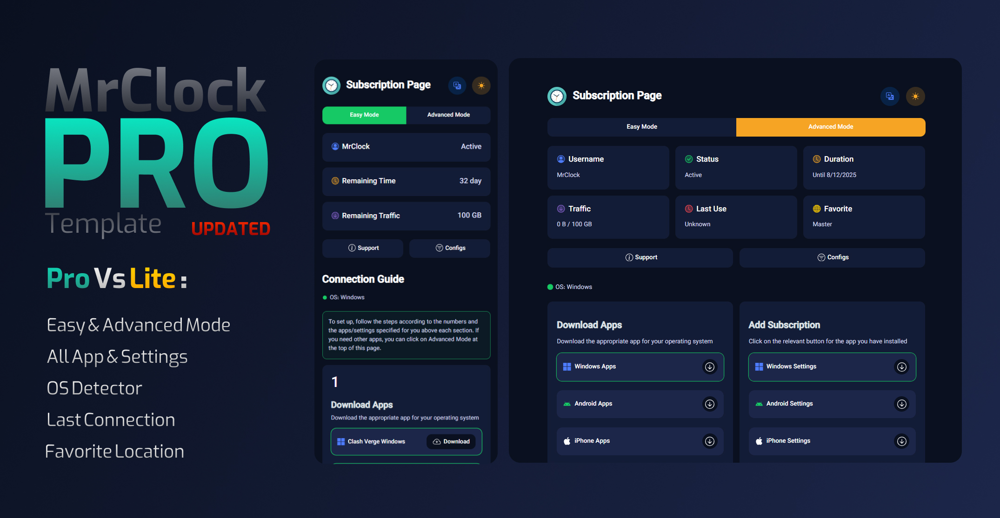

<div align="center">
  


# 📌 قالب صفحه کاربری پنل مرزبان نسخه پرو - MrClock

</div>

<a name="معرفی"></a>
## 🎨 معرفی

<p dir="rtl">
نسخه پرو تمپلیت صفحه کاربری مرزبان با تغییرات گسترده و ویژگی های جدید با طراحی مینیمال و مدرن . طراحی این صفحه توسط بنده و با الهام از تمپلیت مزبانیفای و کد نویسی آن توسط هوش مصنوعی انجام شده . در طراحی این قالب با حساسیت زیادی نیاز های مختلف برای سلیقه های مختلف در نظر گرفنه شده تا مناسب استفاده تمام کاربران باشد . 
</p>


<a name="ویژگی‌ها"></a>
## ✨ ویژگی‌های کلیدی

<div dir="rtl" align="center">

| ویژگی | توضیحات |
|:-----:|---------|
| **⚡ سبک و سریع** | حجم نسبتا کم و بارگذاری سریع |
| **🎨 طراحی مدرن** | رابط کاربری مینیمال و مدرن |
| **🛠 نصب آسان** | راه‌اندازی سریع با چند دستور ساده |
| **🌓 تم روشن و تیره** | پشتیبانی از حالت روشن و تاریک برای خوانایی بهتر |
| **🌐 چند زبانه** | پشتیبانی از زبان‌های فارسی و انگلیسی |
| **💊 حالت آسان** | جهت استفاده راحت تر و بدون پیچیدگی |
| **🩺 حالت پیشرفته** | برای افراد حرفه ای با امکانات بیشتر |
| **📲 برنامه ها** | آرشیو کامل از برنامه های سیستم عامل های مختلف |
| **⚙️ تنظیمات** | تنظیمات خودکار برای اکقر برنامه ها |
| **✅ تشخیص سیستم عامل** | تشخیص سیستم عامل و پینشنهاد برنامه و تنظیمات مرتبط |
| **🕑 آخرین اتصال** | نمایش آخرین زمان اتصال کاربر |
| **🌍 لوکیشن محبوب** | نمایش لوکیشنی که کاربر بیشتر از بقیه از آن استفاده کرده |

</div>

<a name="نصب"></a>
## 📥 نصب و راه‌اندازی

<div>

### 1️⃣ دانلود فایل قالب

</div>

```bash
sudo wget -N -P /var/lib/marzban/templates/subscription/ https://raw.githubusercontent.com/Mrclocks/Pro-Subscription-Template/main/index.html
```

<div>

### 2️⃣ ثبت تنظیمات در محیط مرزبان

</div>

```bash
echo 'CUSTOM_TEMPLATES_DIRECTORY="/var/lib/marzban/templates/"' | sudo tee -a /opt/marzban/.env
echo 'SUBSCRIPTION_PAGE_TEMPLATE="subscription/index.html"' | sudo tee -a /opt/marzban/.env
```

<div>

#### 📝 روش جایگزین: اضافه کردن مستقیم به فایل `.env`

مقادیر زیر را مستقیماً در فایل `.env` واقع در `/opt/marzban/` اضافه کنید:

</div>

```bash
CUSTOM_TEMPLATES_DIRECTORY="/var/lib/marzban/templates/"
SUBSCRIPTION_PAGE_TEMPLATE="subscription/index.html"
```

<div>

### 3️⃣ راه‌اندازی مجدد مرزبان

</div>

```bash
marzban restart
```

<div>

## 🔄 به‌روزرسانی قالب

<div dir="rtl" align="right">
  <p>برای دریافت آخرین نسخه قالب، کافیست مرحله اول (دانلود فایل قالب) را دوباره اجرا کنید.</p>
</div>

<a name="شخصی‌سازی"></a>
## 🛠 شخصی‌سازی

<div dir="rtl" align="center">

| بخش | توضیحات |
|:-----:|---------|
| **تغییر لینک پشتیبانی** | ویرایش خط 1705 و 1713 |
| **تغییر تیتر صفحه (برند)** | ویرایش خط 886 و 955 |
| **تغییر لوگو صفحه (برند)** | ویرایش خط 879 |
| **تغییر لینک برنامه ها** | ویرایش خط 1921 تا 2251 |
| **تغییر رنگ‌ها** | ویرایش خط 19 تا 56 |

</div>

<div dir="rtl" align="right">
  <p> از برنامه هایی شبیه VS code برای ویرایش کد ها استفاده کنید. همچنین می‌توانید با استفاده از ابزارهای هوش مصنوعی مانند deepseek به راحتی بخش‌های مختلف را با سلیقه خود تغییر دهید. لازم به ذکر است بیشتر تغییرات صورت گرفته در این کد‌ها توسط هوش مصنوعی انجام شده است.</p>
</div>

---


<div align="center">
  <p dir="rtl">🌟 اگر از این پروژه خوشتان آمد، لطفاً به آن ستاره دهید 🌟</p>
  
  <p>
    <a href="https://github.com/Mrclocks/MrClock-Subscription-Template">
      
  </p>
  
  <p dir="rtl">با ❤️ توسط MrClock</p>
</div>
