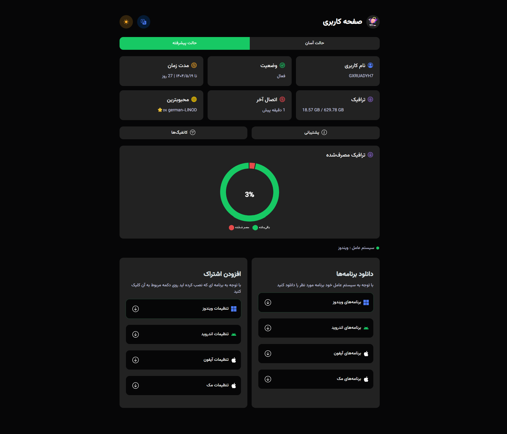

<div align="center">
  


# 📌 قالب صفحه کاربری پنل مرزبان نسخه شخصی سازی شده

</div>


## 🎨 معرفی

<p dir="rtl">
⚠️ این پروژه نسخه‌ی اصلی نیست و تغییر یافته‌ای از (https://github.com/Mrclocks/Pro-Subscription-Template) می‌باشد.
</p>


## ✅ تغییرات انجام‌شده:

🎨 تغییر تم قالب (Template Theme)

📊 افزودن نمودار مصرف کاربران (Usage Chart)

🧭 نمایش روزهای باقیمانده، کنار تاریخ

</div>

## 📥 نصب و راه‌اندازی

<div>

### 1️⃣ دانلود فایل قالب

</div>

```bash
sudo wget -N -P /var/lib/marzban/templates/subscription/ https://raw.githubusercontent.com/sarouk/Pro-Subscription-Template/main/index.html
```

<div>

### 2️⃣ ثبت تنظیمات در محیط مرزبان

</div>

```bash
echo 'CUSTOM_TEMPLATES_DIRECTORY="/var/lib/marzban/templates/"' | sudo tee -a /opt/marzban/.env
echo 'SUBSCRIPTION_PAGE_TEMPLATE="subscription/index.html"' | sudo tee -a /opt/marzban/.env
```

<div>

#### 📝 روش جایگزین: اضافه کردن مستقیم به فایل `.env`

مقادیر زیر را مستقیماً در فایل `.env` واقع در `/opt/marzban/` اضافه کنید:

</div>

```bash
CUSTOM_TEMPLATES_DIRECTORY="/var/lib/marzban/templates/"
SUBSCRIPTION_PAGE_TEMPLATE="subscription/index.html"
```

<div>

### 3️⃣ راه‌اندازی مجدد مرزبان

</div>

```bash
marzban restart
```

<div>

## 🔄 به‌روزرسانی قالب

<div dir="rtl" align="right">
  <p>برای دریافت آخرین نسخه قالب، کافیست مرحله اول (دانلود فایل قالب) را دوباره اجرا کنید.</p>


<div dir="rtl" align="right">
  <p> از برنامه هایی شبیه VS code برای ویرایش کد ها استفاده کنید. همچنین می‌توانید با استفاده از ابزارهای هوش مصنوعی مانند deepseek به راحتی بخش‌های مختلف را با سلیقه خود تغییر دهید. لازم به ذکر است بیشتر تغییرات صورت گرفته در این کد‌ها توسط هوش مصنوعی انجام شده است.</p>
</div>


### 🛠 تغییرات خاص در خطوط مشخص

| خط    | توضیح تغییر             |
|--------|--------------------------|
| 886    | تغییر لوگو               |
| 1756   | تغییر آدرس پشتیبانی      |

---


<div align="center">
  <p dir="rtl">🌟 اگر از این پروژه خوشتان آمد، لطفاً به آن ستاره دهید 🌟</p>
  
  <p>
    <a href="https://github.com/Mrclocks/Pro-Subscription-Template">
      
  </p>
  
